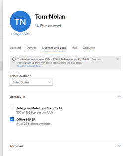

# Table of contents
- [Table of contents](#table-of-contents)
- [General](#general)
- [Important note about accounts](#important-note-about-accounts)
- [Azure](#azure)
  - [Pre-requisites](#pre-requisites)
  - [Setup](#setup)
- [Office 365](#office-365)
  - [Pre-requisites](#pre-requisites-1)
  - [Setup](#setup-1)
- [Enterprise Mobility & Security](#enterprise-mobility--security)
  - [Pre-requisites](#pre-requisites-2)
  - [Setup](#setup-2)
- [Power Platform](#power-platform)
  - [Pre-requisites](#pre-requisites-3)
  - [Setup](#setup-3)

# General

All of the trial accounts below will need a "Microsoft Account" to sign-up for the different services. The easiest way to create a Microsoft Account is to sign up for an Outlook.com email address here: https://outlook.live.com/owa/?nlp=1&signup=1

If you would prefer to use your own email account such as [Proton Mail](https://protonmail.com/) you are free to do so, but you will need to associate your email address with Microsoft to do so. The process for this is simple, just head over to https://account.microsoft.com/ and click the button for "Create a Microsoft Account" and it will walk you through the steps for that.

# Important note about accounts

Be very careful when you sign up for these trials that you are not logged into any other accounts that might be associated with Azure or O365. You won't really hurt anything, but you may end up in a very confusing situation trying to figure out where your services are running!

The best way forward is to use a private browsing session in your browser of choice to ensure you are logged in only to the Microsoft Account that I've mentioned above.

Microsoft Edge  |  Firefox  |  Google Chrome  
----------------|-----------|-----------------
  |    |  

# Azure

You can start with a $200 Azure credit, with 30 days to use it. Then there are a bunch of services that are free for the first 12 months as well as more services that are always free.

## Pre-requisites

- Don't forget to use your private browsing session for this.
- Make sure you have a Microsoft Account ready as outlined above.
  - Note: If you plan to have a full trial environment with Azure+O365+EMS+PowerPlatform, you might want to setup Azure last so you can use your onmicrosoft.com account that you create in the O365 trial process. You don't have to do that, but it would help you to see the integration between an O365 tenant and an Azure tenant. This is not a required step, not even when you are using Azure AD, but it will be a more integrated experience.

## Setup

1. Visit the following site https://azure.microsoft.com/en-us/free/ Feel free to browse through all of the benefits that come with the free account while you are there.

2. Now click the "Start Free" button near the top of the page.

   

3. You will be asked to login to the account you would like to associate with this Azure subscription. If you aren't using an Outlook.com account you will need to create what is referred to as a "Microsoft Account". This is simply associating your external address with Microsoft's systems so you can login with that account id. There is a button that says "Create One" if you need to do that with a non-Outlook.com address.

4. The next few steps will be pretty self explanatory. You will need to enter some of your personal information to create the account and will need to verify you are a human through a text or email. You will also be asked to enter credit card information to verify your identity, but this will absolutely not charge your card at all. If you decide to convert your account later to a paid account, then you can use this credit card information for that.

5. That's it! You can now access your free Azure account by visiting https://portal.azure.com

   

# Office 365 

You can get started with an Office 365 trial relatively easily. If you would like to test out all of the enterprise capabilities that go along with it, the best option is to create an O365 E5 trial. You can also sign-up for an E3 tenant, but for us here, we'll just use the full E5 trial.

## Pre-requisites

- Don't forget to use your private browsing session for this.
- Make sure you have a Microsoft Account ready as outlined above.

## Setup

1. Visit the following site https://www.microsoft.com/en-us/microsoft-365/enterprise/compare-office-365-plans where you can take a look at all of the different Office 365 plans that are available to enterprises. You should see near the top that the E3 and E5 offerings have links that say "Try Free"

2. Either click the "Try Free" link under the Office 365 E5 section on the page you opened in step 1 or you can directly get to the sign-up page by clicking the following link: https://go.microsoft.com/fwlink/p/?LinkID=698279&culture=en-US&country=US

    

3. In the email box, use the email address that you setup back in the beginning of this guide. If you aren't sure what to use here, head back to the top of this page in the [General section](#general) to see what to use here. You'll also need to fill out some personal information in here and verify through text or email.

4. When you get to the third step of the signup process you will need to decide what will be your O365 tenant identifier - this is what you will use to login to O365 services. If you plan to setup a custom domain for your trial, then this isn't too important, but you'll want this to be something easy to remember. Keep in mind this is not a secret identifier so you should only use something that you are ok with being known publicly. For example: if you create a custom domain like contoso.com and point it to your O365 trial for email to test Exchange Online, you will have cnames and mx records that will show your onmicrosoft.com identifier.

5. After you complete the setup, you will be presented with some initial setup prompts such as installing the Office desktop apps, setting up a custom domain, and more. You can skip past most of this for the time being and return to it later if you choose. But you are basically done at this point and will just have to wait for a bit for things like your initial Exchange Online mailbox database to be configured and other background tasks.

    

6. You should now be able to access the O365 Admin center. If you skipped over the final setup steps in the wizard like I did to build this guide, you will be presented with an option to go through the remainder of the guided setup. I would strongly recommend completing that before going any further.

    

# Enterprise Mobility & Security

If you need to test out some of the more advanced security capabilities included in M365 that aren't included with the O365 E5 trial, you can start a trial subscription for Enterprise Mobility & Security E5. EM+S E5 includes a lot of the more advanced security functionality including things like risk based conditional access, privileged identity management, Intune, Cloud App Security (Microsoft's CASB solution) and more.

## Pre-requisites

- Don't forget to use your private browsing session for this.
- You will need to have an O365 tenant where you can add the EM+S functionality. You will likely need to do this in an [O365 trial](#office-365) but you might have a paid O365 tenant where you have admin rights to set this up.

## Setup

1. Visit the following site https://www.microsoft.com/en-us/microsoft-365/enterprise-mobility-security/compare-plans-and-pricing where you can take a look at the different Enterprise Mobility & Security bundles to see what functionality is available. Unlike with O365, we only offer the trial for EM+S E5 here.

2. Either click the "Try now" link towards the bottom of the page in the E5 column, or you can go directly to the sign-up page by clicking the following link: https://go.microsoft.com/fwlink/p/?LinkID=2077039

3. If you created an O365 trial and are still signed into that account, you will be presented with the following screen.

    

   If you are not signed into an O365 tenant already, you will see the following screen.

    

   If you aren't testing O365 features, you may want to just signup here and create a new tenant. This may add some confusion later, but it's a valid way to proceed. However, **I would strongly recommend you use an O365 trial as configured above unless you are an experienced O365/EMS admin and are testing very specific functionality here.** 

   Note: If you did not use an O365 trial tenant for this, you will have to go through and complete some details about yourself to finish the setup. This guide is meant to have a full trial setup though, so I'm going to only address the next step in the process of adding the EM+S trial to an O365 trial that you setup earlier.

4. Now you should see a screen showing you are ordering a 3-month trial and adding it to your O365 tenant. Click the "Try now" button and then on the following screen confirm the addition.

    

5. The final step is assigning the EMS license to users in your tenant. In the O365 admin portal, go to the Active Users section, find the user you want to assign the license to, click the three dots next to their name, and click "manage product licenses"

    

6. You will be presented with a slide out menu on the right side of the screen showing the various licenses available to you in your tenant. You should see a new option for EM+S E5. Check the box for EM+S and then save your changes.

    

# Power Platform

If you already went through and created an O365 trial, then you already have access to the Power Platform! There is a lot of functionality that is included directly with an O365 subscription that will allow you to use Power BI, Power Apps, Power Automate, and Power Virtual Agents. However, if you want to access some of the more premium functionality to test, such as connecting to external providers like SAP, Zendesk, Seismic, or connecting to other premium Microsoft services like SQL Server, Dynamics 365, or Azure, then you may want to test out the premium functionality available to Power Platform in a premium trial.

Check out more here about the Power Platform: https://powerplatform.microsoft.com/en-us/

## Pre-requisites

- Don't forget to use your private browsing session for this.
- You will need to have an O365 tenant where you can add the Power Platform licenses. Although you can do this in a work or school account that you may already have, if you are reading this guide, you will probably want to follow the [O365 instructions above](#office-365) and put this into an O365 Trial as well.

## Setup

1. There are a variety of ways to set up Power Platform trials, and Microsoft has written a pretty detailed guide on setting this up. Rather than reinvent the wheel, I'm going to point you to their documentation. The only suggestion I have here is when they tell you to login to the Power Platform admin portal, do that using the admin account you created above in the O365 trial setup.

2. Visit this link to follow the official guide of setting up Power Platform trials https://docs.microsoft.com/en-us/power-platform/admin/trial-environments
